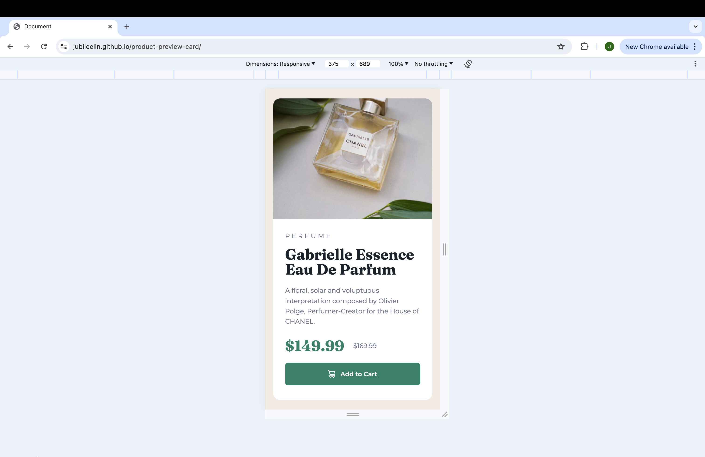

# Frontend Mentor - Product preview card component solution

This is a solution to the [Product preview card component challenge on Frontend Mentor](https://www.frontendmentor.io/challenges/product-preview-card-component-GO7UmttRfa). Frontend Mentor challenges help you improve your coding skills by building realistic projects. 

## Table of contents

- [Overview](#overview)
  - [The challenge](#the-challenge)
  - [Screenshot](#screenshot)
  - [Links](#links)
  - [Built with](#built-with)
  - [What I learned](#what-i-learned)
  - [Continued development](#continued-development)
- [Author](#author)

**Note: Delete this note and update the table of contents based on what sections you keep.**

## Overview

### The challenge

Users should be able to:

- View the optimal layout depending on their device's screen size
- See hover and focus states for interactive elements

### Screenshot

### Links

- Live Site URL: (https://jubileelin.github.io/product-preview-card/)

## My process

### Built with

- Semantic HTML5 markup
- CSS custom properties
- Flexbox
- CSS Grid
- Mobile-first workflow

### What I learned

I struggled quite a bit on this challenge because it was my first introduction to responsive design. I initially made a version which had a lot of media queries and did not work very well. However, after taking some time to research responsive units and functions, I started the project again from scratch and was able to come up with this final version. 

### Continued development

Although this project was extremely helpful in giving me more insight into responsive design, I still want to try to get more comfortable in responsive design and units. 

## Author
- Frontend Mentor - [@jubileelin](https://www.frontendmentor.io/profile/jubileelin)
